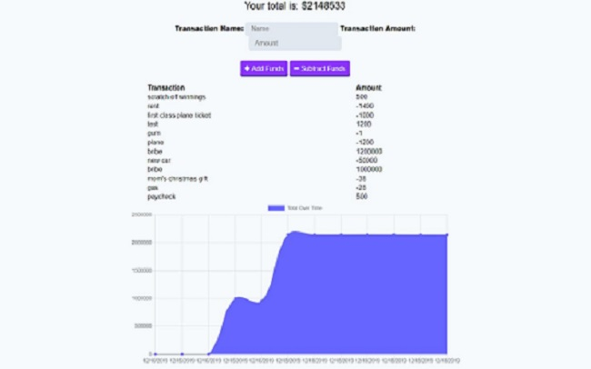

# [budget-book](https://budgetbookhw.herokuapp.com/)

## Description
The purpose of this assignment was to take a budget app that we previously created in class and add the ability to use it offline by utilizing a service worker file to cache necessary files and api responses. The application provides a visual documentation of the user's expenses in the form of a graph. Any new transactions, causing an increase or decrease in funds, created while offline are cached in the IndexedDB and then posted via the server an internet connection is reestablished.

This allows a user to enjoy the primary functionalities of the application without internet connection, but also makes sure none of the information is lost when online again, updating the database with whatever it missed while offline. Users can also install the application to their device rather than having to open a browser and navigate to the site each time.

**Relevant new concepts**: IndexedDB, progressive web apps(PWAs), service workers, Cache API

## Challenges
I had a hard time understanding how the service worker communicated with IndexedDB to store information and how it differed from the cache. I used some of the class activities as a guide but I'm still not entirely clear on how it all works.

Thanks to my tutor, Phil, for helping clarify some of the structure.

## Sources
- Class activities on PWAs
- [Caching with Service Workers](https://developers.google.com/web/ilt/pwa/caching-files-with-service-worker)
- [IndexedDB: object stores](https://developers.google.com/web/ilt/pwa/working-with-indexeddb)